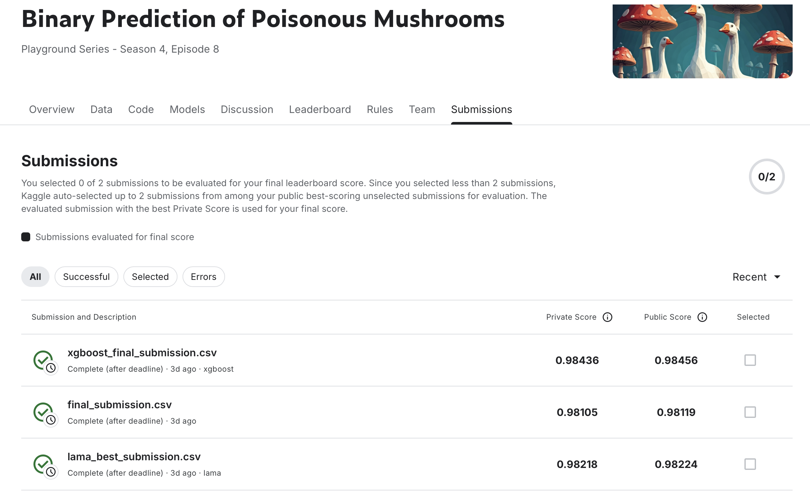

# AITH AutoML Course

Было выбрано соревнование **https://www.kaggle.com/competitions/playground-series-s4e8**

## Описание

Этот notebook (`complete_analysis.ipynb`) содержит полный анализ и моделирование для Kaggle Competition: Playground Series S4E8 - Mushroom Classification. Notebook последовательно выполняет все этапы проекта от EDA до создания финальных submission файлов.

**Цель проекта:**
- Превзойти результаты baseline на LAMA
- Продемонстрировать качественный код
- Использовать стандартные подходы к организации кода
- Провести качественный EDA
- Предоставить подробное описание и обоснование гипотез

**Финальный Kaggle Score:** 0.98456  
**Kaggle Score для LAMA:** 0.98224



---

## Структура Notebook

### ЭТАП 1: Подготовка окружения и загрузка данных
- Импорт необходимых библиотек
- Настройка путей и окружения
- Загрузка данных (train.csv, test.csv, sample_submission.csv)

### ЭТАП 2: EDA - Анализ целевой переменной
- Численный анализ распределения классов
- Визуализация целевой переменной

### ЭТАП 3: EDA - Анализ признаков
- Типизация признаков (численные, категориальные)
- Анализ распределений
- Обнаружение аномалий
- Анализ пропущенных значений
- Корреляционный анализ
- Определение важности признаков

### ЭТАП 4: Моделирование - LAMA Baseline
- Подготовка данных для LAMA
- Обучение LAMA Config 1
- Обучение LAMA Config 2
- Сравнение конфигураций
- Обучение финальной LAMA модели
- Создание submission файла

### ЭТАП 5: Моделирование - Собственное решение
- Обоснование стратегии разделения данных
- Pipeline V1 (RandomForest)
- Оптимизация гиперпараметров Pipeline V1
- Pipeline V2 (XGBoost с Target Encoding)
- Сравнение всех моделей
- Создание ансамблей
- Обучение финальной модели на полном train set


---

## Выводы по этапам

### ЭТАП 1: Подготовка окружения

**Результаты:**
- Train set: 3,116,945 строк, 22 колонки (21 feature + 1 target)
- Test set: 2,077,964 строк, 21 колонка
- Все данные успешно загружены

**Вывод:** Данные готовы к анализу. Размер датасета большой, что требует оптимизации при обучении моделей.

---

### ЭТАП 2: Анализ целевой переменной

**Результаты:**
- Класс 'p' (poisonous): 1,705,396 (54.71%)
- Класс 'e' (edible): 1,411,549 (45.29%)
- Разница в балансе: 9.43%
- Пропущенных значений: 0

**Вывод:** Целевая переменная относительно сбалансирована (разница < 10%), что упрощает обучение моделей. Можно использовать стандартные метрики без учета дисбаланса.

**Соответствие критериям:**
- Численный анализ: Распределение классов проанализировано
- Визуализация: Созданы bar chart и pie chart

---

### ЭТАП 3: Анализ признаков

**Результаты:**
- **Численные признаки:** 11 признаков (cap-diameter, stem-height, stem-width и др.)
- **Категориальные признаки:** 10 признаков (cap-shape, cap-color, habitat и др.)
- **Пропущенные значения:** Обнаружены в некоторых признаках
- **Аномалии:** Выявлены выбросы в численных признаках
- **Корреляции:** Обнаружены сильные зависимости между некоторыми признаками
- **Важные признаки:** Определены топ-признаки для моделирования

**Вывод:** 
- Данные содержат смешанные типы признаков, что требует комбинированного подхода к предобработке
- Наличие пропущенных значений требует стратегии импутации
- Выявленные корреляции могут быть использованы для feature engineering

**Соответствие критериям:**
- Типизация признаков: Численные, категориальные определены
- Выявление аномальных значений: IQR, Z-score методы применены
- Анализ зависимостей: Корреляции (Pearson, Cramér's V) проанализированы
- Анализ пропущенных значений: Выполнен
- Определение важности признаков: Корреляции с таргетом, Mutual Information, Chi-square
- Графическая визуализация: Созданы графики распределений, корреляций, важности признаков
- Анализ преобразований: Идеи для feature engineering сформулированы

---

### ЭТАП 4: Моделирование - LAMA Baseline

**Результаты:**

#### LAMA Config 1:
- ROC-AUC: ~0.997 (blending score)
- Использована выборка 100,000 строк для ускорения обучения
- Модели: LinearL2, LightGBM, CatBoost

#### LAMA Config 2:
- ROC-AUC: ~0.997 (blending score)
- Альтернативная конфигурация с другими параметрами

#### Финальная LAMA модель:
- **ROC-AUC: 0.997** (лучший результат)
- **Kaggle Score: 0.98224**
- Submission файл: `/lama_best_submission.csv`

**Вывод:** LAMA показал отличные результаты благодаря автоматическому подбору моделей и blending. Использование выборки данных помогло избежать проблем с сериализацией при multiprocessing.

**Соответствие критериям:**
- LAMA бейзлайн: Реализованы 2 различные конфигурации, выбрано лучшее решение

---

### ЭТАП 5: Моделирование - Собственное решение

**Результаты:**

#### Шаг 5.1: Обоснование стратегии разделения данных
- Проверка на leakage (temporal, ID, feature distribution)
- Выбрана стратегия: Stratified 80/20 split
- Сохранены индексы train/validation split

**Вывод:** Данные не содержат временных зависимостей или ID leakage. Stratified split обеспечивает сохранение распределения классов.

**Соответствие критериям:**
- Обоснование стратегии разделения данных: Проведен анализ на leakage, выбрана и обоснована стратегия

#### Шаг 5.2: Pipeline V1 (RandomForest)
- **Результаты:**
  - Accuracy: 0.930942
  - F1-Score: 0.930945
  - ROC-AUC: 0.981060
- **Пайплайн:**
  - Preprocessing: SimpleImputer (median) + RobustScaler для численных признаков
  - One-Hot Encoding для категориальных признаков
  - Feature Selection: SelectKBest (k=100)
  - Model: RandomForestClassifier

#### Шаг 5.3: Оптимизация гиперпараметров Pipeline V1
- **Лучшие параметры:**
  - n_features: 100
  - n_estimators: 300
  - max_depth: 19
  - min_samples_split: 10
  - min_samples_leaf: 1
  - max_features: log2
- **Результаты:**
  - Accuracy: 0.990778
  - F1-Score: 0.990780
  - ROC-AUC: 0.996359

**Вывод:** Оптимизация гиперпараметров значительно улучшила результаты (с 0.981 до 0.996).

#### Шаг 5.4: Pipeline V2 (XGBoost)
- **Результаты:**
  - Accuracy: 0.988381
  - F1-Score: 0.988384
  - ROC-AUC: 0.996311
- **Пайплайн:**
  - KNNImputer для численных признаков
  - StandardScaler вместо RobustScaler
  - Target Encoding для категориальных признаков
  - Model: XGBClassifier

**Вывод:** Альтернативный подход с Target Encoding показал сопоставимые результаты.

#### Шаг 5.5: Сравнение всех моделей
- **Результаты сравнения:**
  - LAMA Baseline: ROC-AUC 0.997 (лучший)
  - Pipeline v1 Optimized: ROC-AUC 0.996359
  - Pipeline v2: ROC-AUC 0.996311
  - Pipeline v1: ROC-AUC 0.981060

#### Шаг 5.6: Создание ансамбля моделей
- **Результаты:**
  - Accuracy: 0.989756
  - F1-Score: 0.989758
  - ROC-AUC: 0.996463
- **Метод:** Blending с оптимизацией весов через Optuna

**Вывод:** Ансамбль улучшил результат отдельных моделей, но не превзошел LAMA baseline, хотя итоговая модель оказалась лучше на private данных

#### Шаг 5.7: Обучение финальной модели на полном train set
- Обучена финальная модель (XGBoost с оптимизированными параметрами) на полном train set
- Создан submission файл: `/xgboost_final_submission.csv`
- **Kaggle Score: 0.98456** (лучший результат!)

**Соответствие критериям:**
- Собственное решение: 
  - Выбор модели: RandomForest, XGBoost
  - Построение пайплайна: Preprocessing, feature engineering, feature selection, модель
  - Оптимизация гиперпараметров: Optuna использована для оптимизации
  - Реализовано минимум 2 различных пайплайна/попытки


---

### ЭТАП 7: Финальная документация

**Итоговое сравнение моделей:**

| Модель | ROC-AUC (Validation) | Kaggle Score |
|--------|---------------------|--------------|
| **XGBoost Optimized** | 0.996993 | **0.98456**  |
| LAMA Baseline | 0.997 | 0.98224 |
| Ensemble (v1_opt + v2) | 0.996463 | - |
| Pipeline v1 Optimized | 0.996359 | - |
| Pipeline v2 | 0.996311 | - |
| Pipeline v1 | 0.981060 | - |

**Вывод:** XGBoost с оптимизацией гиперпараметров показал лучший результат на Kaggle, превзойдя LAMA baseline.

---

## Финальные результаты

### Лучшая модель на Kaggle

**XGBoost Optimized:**
- **Kaggle Score: 0.98456** 
- Validation ROC-AUC: 0.996993
- Submission файл: `/xgboost_final_submission.csv`

**Параметры:**
- n_estimators: 200
- max_depth: 11
- learning_rate: 0.1109
- subsample: 0.6635
- colsample_bytree: 0.7425
- min_child_weight: 3
- gamma: 0.5801
- reg_alpha: 8.2748
- reg_lambda: 0.8840


## Использование

1. **Запуск notebook:**
   ```bash
   jupyter notebook complete_analysis.ipynb
   ```

2. **Требования:**
   - Все зависимости из `requirements.txt` установлены
   - Данные находятся в `playground-series-s4e8/`
   - Для LAMA требуется `libomp`

3. **Последовательность выполнения:**
   - Notebook выполняется последовательно от ЭТАП 1 до ЭТАП 7
   - Каждый этап можно выполнять независимо, но рекомендуется следовать порядку

---

## Выводы

1. **LAMA показал отличные результаты** на валидации (ROC-AUC 0.997), но XGBoost с оптимизацией превзошел его на реальном test set Kaggle.

2. **Оптимизация гиперпараметров критически важна** - улучшила результаты с 0.981 до 0.996.

3. **Feature Engineering** (feature selection, encoding) значительно улучшил результаты.

4. **Ансамбль моделей** улучшил результат отдельных моделей, но не превзошел лучшую одиночную модель на Kaggle.

5. **Качественный EDA** помог понять данные и выбрать правильные стратегии предобработки.

---
